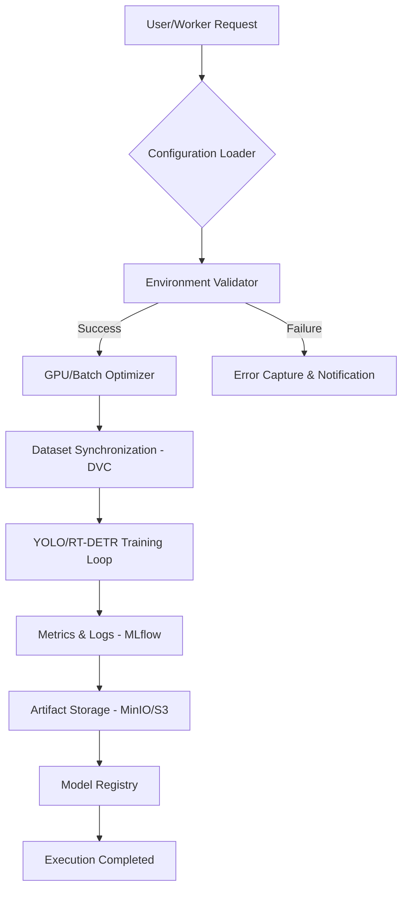
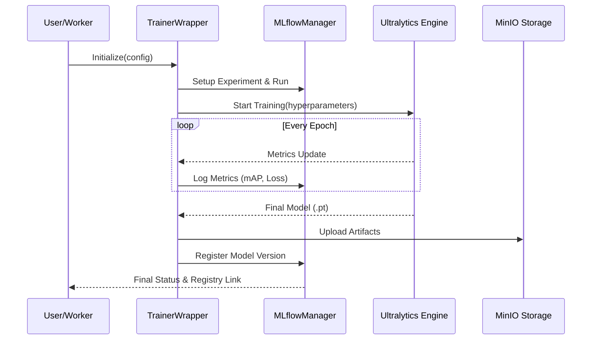
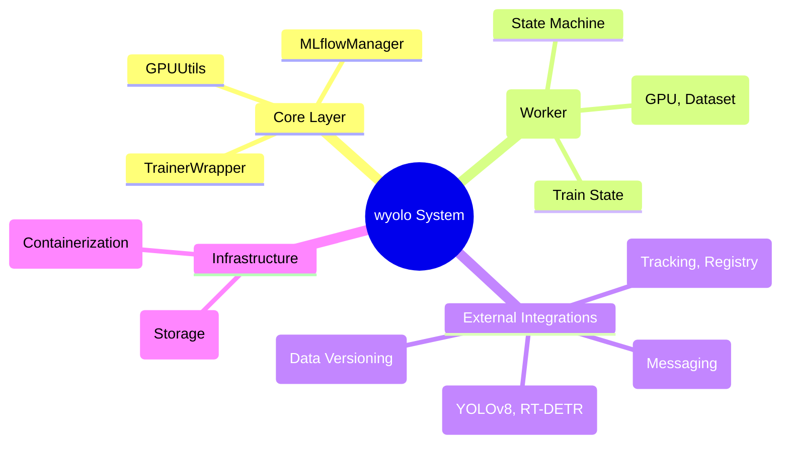

# wyolo: Professional YOLO MLOps Framework

[](https://www.pylint.org/)
[](https://github.com/PyCQA/bandit)
[](https://www.python.org/)
[](https://opensource.org/licenses/MIT)

**wyolo** is a high-performance, enterprise-grade Python library designed to orchestrate the entire lifecycle of YOLO and RT-DETR models. By integrating native MLOps capabilities, `wyolo` transforms experimental computer vision into production-ready automated pipelines.

---

### 1. 🚶 Diagram Walkthrough
The following diagram illustrates the high-level execution flow from user request to model registration.



---

### 2. 🗺️ System Workflow
Detailed sequence of events during a critical training operation, highlighting the interaction between core components.



---

### 3. 🏗️ Architecture Components
Static structure and dependencies of the `wyolo` ecosystem.



---

### 4. ⚙️ Container Lifecycle

#### a. Build Process
The construction of the production-ready artifact follows a multi-stage approach:
1.  **Base Image Selection:** Utilizes NVIDIA CUDA-enabled Python images for GPU acceleration.
2.  **Dependency Resolution:** Installation of system-level libraries (`libgl1-mesa-glx`) and project dependencies via `pip`.
3.  **Code Injection:** Surgical copying of the `src/` directory and configuration templates.
4.  **Environment Sanitization:** Setting of non-root users and file permissions for secure execution.

#### b. Runtime Process
From instantiation to operational readiness:
1.  **Entrypoint Execution:** The container starts via `train_service.sh`.
2.  **State Initialization:** The `main.py` state machine loads the specific configuration.
3.  **Resource Discovery:** Automatic detection of CUDA devices and available VRAM.
4.  **Data Mounting:** CIFS/NFS mounts or DVC pulls to ensure dataset availability.
5.  **Steady State:** The worker enters the training loop, reporting heartbeats to Redis/MLflow.

---

### 5. 📂 File-by-File Guide

| Path | Purpose |
|:---|:---|
| `src/wyolo/core/` | Core logic for trainer wrappers, MLflow management, and GPU utilities. |
| `src/wyolo/app/` | Production worker implementation using a robust state-machine architecture. |
| `src/wyolo/trainer/` | Specialized model-type implementations and elemental DTOs. |
| `src/wyolo/docker/` | Orchestration scripts and requirements for containerized environments. |
| `pyproject.toml` | Project metadata, build system configuration, and dependency locks. |
| `Makefile` | Standardized automation for installation, testing, and documentation. |
| `tests/` | Comprehensive test suite ensuring behavioral and structural integrity. |

---

## 🛠 Technical Stack
- **Engine:** [Ultralytics](https://github.com/ultralytics/ultralytics) (YOLOv8, RT-DETR).
- **Tracking:** [MLflow](https://mlflow.org/).
- **Versioning:** [DVC](https://dvc.org/).
- **Backend:** Python 3.8+ with [Loguru](https://github.com/Delgan/loguru) for logging.
- **Containerization:** Docker with NVIDIA Container Toolkit.
- **Quality:** Pytest, Pylint, Bandit.

---

## 🚀 Installation & Setup

### Environment Preparation
```bash
# Clone the repository
git clone https://github.com/wisrovi/wyoloservice2_worker.git
cd wyoloservice2_worker

# Create and activate virtual environment
python -m venv venv
source venv/bin/activate
```

### Automation with Makefile
```bash
# Install all dependencies (including dev)
make install

# Run security and linting checks
make lint

# Execute test suite
make test
```

---

## 📈 Configuration & Usage

### Configuration (YAML)
Create a `config.yaml` to define your experiment:
```yaml
model: yolov8n.pt
type: detect
train:
  epochs: 100
  imgsz: 640
mlflow:
  uri: "http://your-mlflow-server"
```

### Execution
```bash
# Run training via CLI
wyolo-train --config_path config.yaml --fitness map50
```

---

## 👨‍💻 Author
**William Rodríguez - wisrovi**  
*Technology Evangelist & AI Solutions Architect*  
[LinkedIn Profile](https://es.linkedin.com/in/wisrovi-rodriguez)

---

## 📄 Bibliography & Source Resources
- [Ultralytics Documentation](https://docs.ultralytics.com/)
- [MLflow Guide](https://mlflow.org/docs/latest/index.html)
- [DVC Official Tutorials](https://dvc.org/doc)
