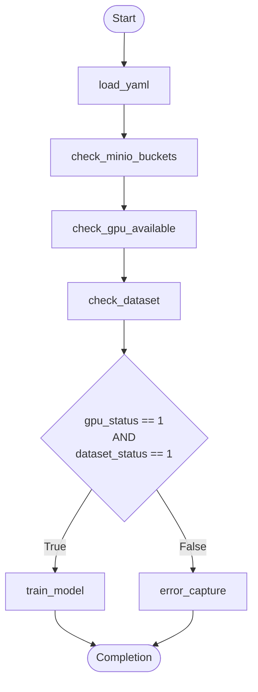
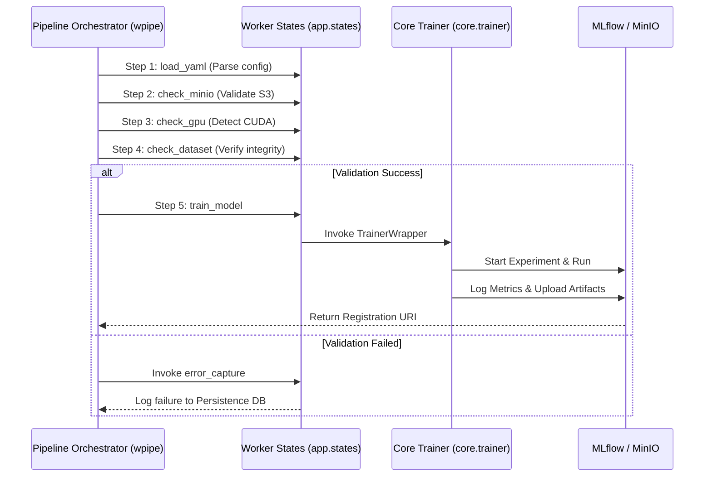
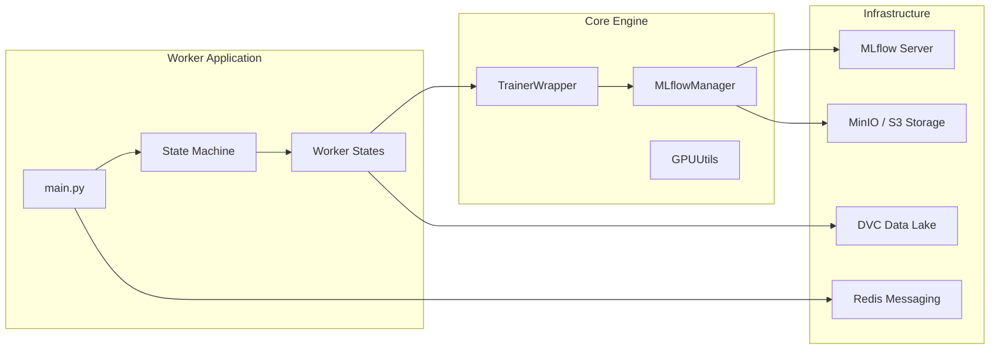

# wyolo: Professional YOLO MLOps Orchestrator

[](https://www.pylint.org/)
[](https://github.com/PyCQA/bandit)
[](https://www.python.org/)
[](https://opensource.org/licenses/MIT)

**wyolo** is an enterprise-grade framework designed to manage the full lifecycle of YOLO and RT-DETR models. By leveraging a robust **State Machine** architecture and native **MLOps** integrations, `wyolo` provides a high-resiliency environment for computer vision training, tracking, and deployment.

---

## 🏗️ Architecture & System Design

### 1. 🚶 Execution Walkthrough (State Machine)
The system operates as a deterministic pipeline governed by conditional logic. It ensures environment integrity before committing expensive GPU resources.



### 2. 🗺️ Detailed System Workflow
Sequence of operations between the orchestrator, specialized states, and external MLOps entities.



### 3. 🗺️ Architecture Components
A layered view of the ecosystem, illustrating the separation between orchestration, business logic, and infrastructure.



---

## ✨ Key Features & Performance

- **🚀 State-Driven Orchestration:** Complex logic implemented via `wpipe` for maximum resiliency.
- **🛡️ Quality-First Design:** Maintains **Pylint > 9.5** and regular **Bandit** security audits.
- **📊 Native MLOps:** Built-in **MLflow** tracking, automated model registry, and **DVC** data versioning.
- **⚡ Resource Efficiency:** Real-time monitoring of Peak RAM, CPU usage, and VRAM optimization.
- **📦 Distributed Architecture:** Designed to run as an independent worker container (`wtrain-service`).

---

## ⚙️ Lifecycle Management

### a. Build Process (CI/CD)
1.  **Multi-Stage Dockerfile:** Optimizes image size while providing CUDA/CUDNN support.
2.  **Environment Isolation:** Automatic resolution of complex dependencies (RT-DETR, MLflow, Redis).
3.  **Sanity Checks:** Static analysis executed during the build phase.

### b. Runtime Process (Execution)
1.  **Initialization:** `train_service.sh` triggers the service wrapper.
2.  **Discovery:** Automatic discovery of GPU topology and dataset paths.
3.  **Orchestration:** The Pipeline engine manages retries, timeouts, and state transitions.
4.  **Persistence:** Results and logs are persisted to `wtrain.db` (SQLite WAL) for audit trails.

---

## 📂 File-by-File Guide

| Component | Description |
|:---|:---|
| `src/wyolo/app/main.py` | Entry point. Configures the `wpipe` state machine and orchestrates the worker. |
| `src/wyolo/app/states/` | Atomic state implementations (Check GPU, Dataset, MinIO, Train). |
| `src/wyolo/core/` | Core logic for the `TrainerWrapper` and `MLflowManager`. |
| `src/wyolo/docker/` | Production-ready orchestration scripts and requirements. |
| `src/wyolo/trainer/` | Specialized DTOs and implementation of the Elemental design pattern. |
| `Makefile` | The central command center for installation, testing, and deployment. |
| `index.html` | High-impact landing page for project stakeholders. |

---

## 📂 Project Structure
```text
src/wyolo
├── app
│   ├── main.py                <-- Orchestrator
│   └── states                 <-- State Machine Steps
│       ├── check/             <-- Validation Logic
│       ├── train/             <-- Training Execution
│       └── error_process/     <-- Resiliency Handling
├── core
│   ├── trainer_wrapper.py     <-- Engine Wrapper
│   └── mlflow_manager.py      <-- MLOps Tracking
└── docker
    ├── train_service.sh       <-- Production Entrypoint
    └── requirements.txt       <-- Locked Dependencies
```

---

## 🚀 Installation & Usage

```bash
# 1. Setup environment
make install

# 2. Run linting & security
make lint

# 3. Execute training suite
wyolo-train --config_path my_config.yaml
```

---

## 👨‍💻 Author
**William Rodríguez - wisrovi**  
*Technology Evangelist & AI Solutions Architect*  
[LinkedIn Profile](https://es.linkedin.com/in/wisrovi-rodriguez)

---

## 📄 Bibliography & Resources
- [Ultralytics Framework](https://docs.ultralytics.com/)
- [MLflow MLOps Platform](https://mlflow.org/)
- [wpipe Orchestration Library](https://github.com/wisrovi/wpipe)
