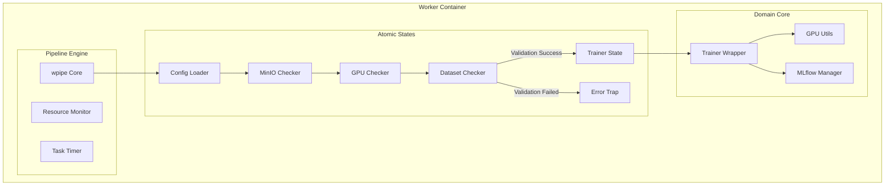

# Architecture & Backend Core

## 1. Executive Technical Summary

The backend core is architected as a highly resilient, deterministic worker microservice designed for the orchestration of intensive computer vision training workloads (YOLOv8, RT-DETR). It departs from traditional monolithic training scripts by wrapping the core Deep Learning engine (Ultralytics) within a state-driven pipeline (`wpipe`). 

This architecture guarantees that expensive computational resources (GPUs) are only engaged when all external dependencies (S3/MinIO, Datasets, MLflow tracking servers) are strictly validated.

## 2. Core Architecture Paradigm

The architecture follows a **Decoupled Orchestration Pattern**:
1.  **State Machine Layer (`app/main.py`)**: Acts as the central nervous system. It defines the strict sequence of operations, error boundaries, and timeouts (`TaskTimer`, `ResourceMonitor`).
2.  **Domain Logic Layer (`app/states/`)**: Encapsulates atomic, idempotent operations. Each step in the pipeline (e.g., checking GPU, loading YAML) is an isolated function, ensuring single-responsibility.
3.  **Engine Wrapper Layer (`core/`)**: The `TrainerWrapper` abstracts the underlying framework (Ultralytics), exposing a standardized interface for configuration, training execution, and MLflow/Artifact synchronization.

### High-Level Architecture Diagram

## 3. Justification of Technology Stack

-   **Python 3.8+**: Provides the necessary ecosystem for MLOps and Deep Learning.
-   **wpipe**: Selected for its deterministic pipeline execution, state tracking, and built-in resource monitoring, preventing zombie processes during long training runs.
-   **MLflow & MinIO**: Standardizes the artifact lifecycle, ensuring that every model weight and metric is traceable and securely stored off-node.
-   **SQLite WAL**: Utilized by the pipeline engine for fast, non-blocking state persistence, enabling resumption and strict audit trails.