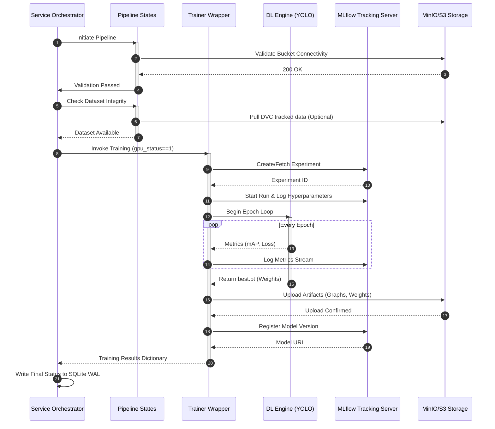

# Communication Flow

## 1. Internal vs External Communication

The microservice operates as a hybrid entity:
-   **Internally**: It communicates synchronously via in-memory state passing orchestrated by the pipeline engine. State dictionaries are passed from one atomic function to the next.
-   **Externally**: It relies heavily on asynchronous/RESTful APIs to validate infrastructure and log metrics. It communicates with S3/MinIO for dataset/artifact retrieval, MLflow for experiment tracking, and potentially Redis for asynchronous event broadcasting.

## 2. Cross-System Sequence Diagram

The following sequence diagram illustrates the complex flow of a successful training lifecycle, highlighting the boundaries between the local worker and external enterprise services.

## 3. Communication Resilience

-   **Failure Isolation**: If communication with MLflow or S3 fails during the initialization states (`check_minio_buckets`), the pipeline halts before allocating GPU memory, routing directly to the `error_capture` state.
-   **Timeout Enforcement**: The entire pipeline is wrapped in a `TaskTimer` (e.g., 900 seconds), ensuring that network hangs with external services do not lock the worker indefinitely.