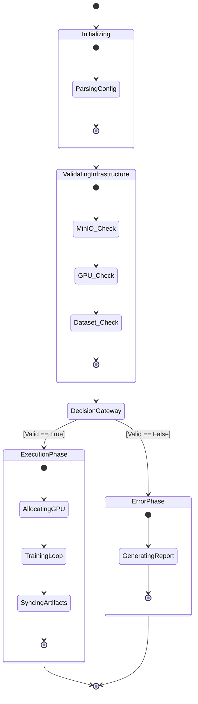

# Microservice Design

## 1. Structural Overview

The application is structured as a standalone headless worker (`wtrain-service`). It is designed to be instantiated via Docker, execute a single workload defined by a YAML configuration, and terminate gracefully.

## 2. Directory and Module Specifications

### `app/main.py`
The orchestrator. It configures the pipeline parameters (retries, timeouts, telemetry) and defines the Directed Acyclic Graph (DAG) of the states.

### `app/states/check/`
Contains the validation logic. This is a critical design pattern: "Fail Fast, Fail Cheap".
-   `check_dataset.py`: Verifies the existence and format of the target images/labels.
-   `check_gpu.py`: Probes the PCIe bus for CUDA devices. Determines VRAM availability.
-   `check_minio.py`: Asserts network paths to object storage are open and authenticated.

### `app/states/train/`
-   `train.py`: The execution state. It is only reachable if all `check/` states return a positive signal. It acts as the bridge between the pipeline engine and the `TrainerWrapper`.

### `app/states/error_process/`
-   `error_capture.py`: The global exception handler for the pipeline. Any failure in the validation or training phases routes here to construct a standardized error payload for external monitoring systems.

## 3. Microservice State Diagram

