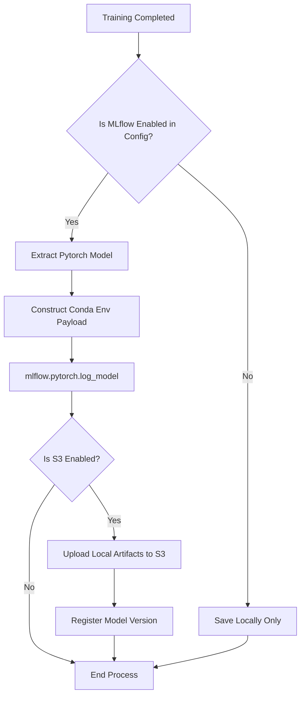

# Logic Design

## 1. Business Logic Abstraction

The core business logic resides in bridging the gap between raw compute (Ultralytics YOLO) and Enterprise MLOps (MLflow). The logic is designed to automate manual Data Science tasks.

## 2. Key Algorithms and Workflows

### Auto-Batching and GPU Optimization
One of the core logic components is `gpu_utils.py` and its integration with the `TrainerWrapper`. Instead of relying on static batch sizes which frequently cause Out-Of-Memory (OOM) errors across heterogeneous clusters, the system implements an auto-discovery logic.

1.  **VRAM Probing**: `GPUtil` queries the exact available VRAM.
2.  **Fractional Allocation**: The system calculates the safest maximum batch size based on the model's parameter count and current available memory, falling back to Ultralytics native `autobatch` if needed.

### Dynamic Pipeline Evaluation
The execution of the training itself is gated by a boolean expression evaluated at runtime by the pipeline engine:

```python
Condition(
    expression="gpu_status == 1 and dataset_status == 1",
    branch_true=[train_model],
    branch_false=[],
)
```
This logic prevents the system from entering a crash loop. If the dataset is corrupt or the GPU is locked by another process, the worker exits gracefully.

### MLOps Artifact Synchronization Logic
The logic in `TrainerWrapper.on_train_end` overrides standard callbacks to inject enterprise tracking:
1.  **Metric Extraction**: Extracts raw metrics from the engine.
2.  **Sanitization**: Uses `slugify` to ensure metric keys are compatible with database constraints.
3.  **Model Packaging**: Wraps the raw `.pt` weights into an `MLflowYOLOModel` definition to ensure it can be served later via MLflow's native deployment tools, defining conda environments dynamically.

## 3. Decision Tree: Model Registration

