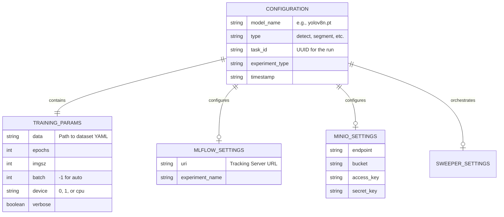
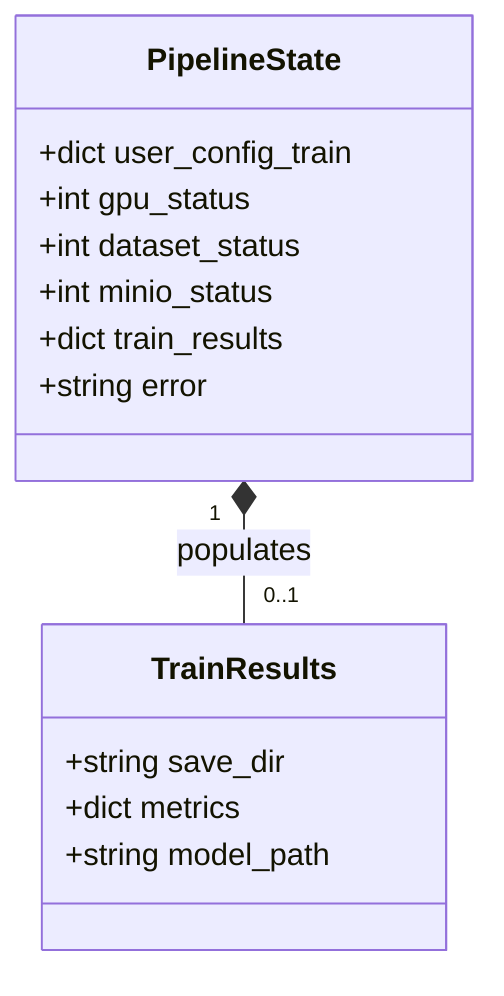

# Data Diagrams & Models

## 1. Configuration Data Model

The primary data structure driving the microservice is the Configuration Dictionary (typically parsed from YAML). It acts as the ultimate source of truth for the entire run.

### Entity-Relationship Representation

## 2. In-Memory State Model (Pipeline Runtime)

During execution, the pipeline engine passes a state dictionary between functions. This payload dynamically expands.

## 3. MLOps Artifact Schema

When the system logs to MLflow, it adheres to a strict schema to ensure compatibility with model registries:
-   **Artifact Path**: `/models/study_name/type/task_id/trial/`
-   **Metrics**: Keys are strictly sanitized (e.g., `metrics/mAP50-95(B)` becomes `metrics-map50-95-b`).
-   **Tags**: Hardware telemetry (GPU Name, VRAM) is injected as key-value tags associated with the run UUID.